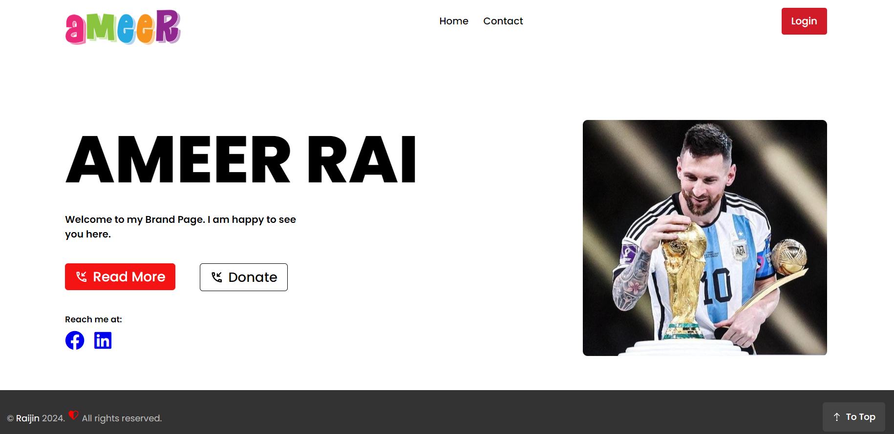
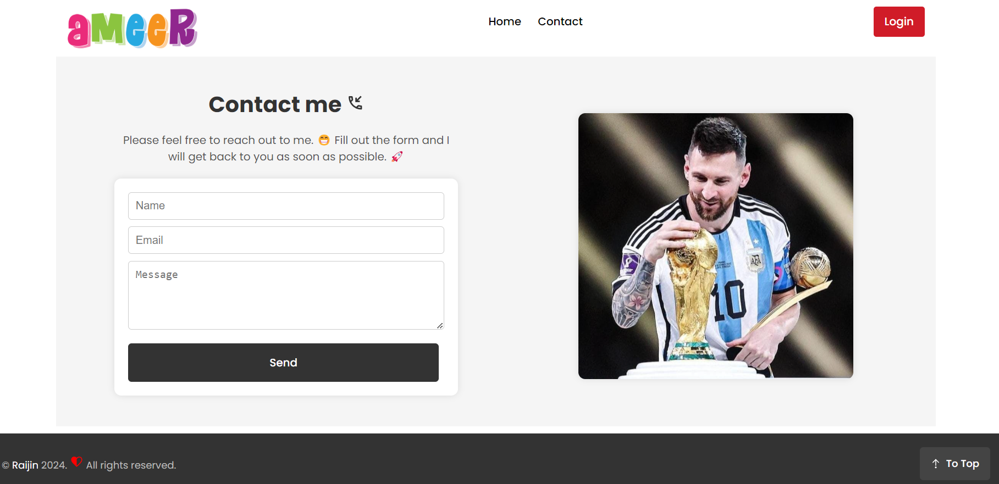

# Brand-Page
Brand Page Project using React

# Daywise Timeline Project Development:
    Day 1: Project Setup, installation using vite in react
    Day 2: Execute code and Filter default code
    Day 3: Add Nav and body div to app.jsx, and style to app.
    Day 4: Organized nav and body to component and added new images
    Day 5: Added media queries to app.css for responsiveness
    Day 6: Added Fontawesome to social accounts, and some changes
    Day 7: Using Dynamic Class Syntax, and CSS module in Nav component
    Day 8: Applying module based css and dynamic class in Body.jsx
    Day 9: App-level routing using react router in Nav.jsx
    Day10: Added Contact page with proper routing
    Day11: Updating, optimizing styles, content of contact page
    Day12: Optimized style of Nav, removed other unneeded menus
    Day13: Added Footer section
    Day14: Made Contact page responsive using media queries
    Day15: (filtered) Added react icons to footer and made footer responsive
    Day16: Added "To Top" button in footer
    

<h1>Screenshots:</h1>

Fig1: Home Page

 

Fig2: Contact Page

